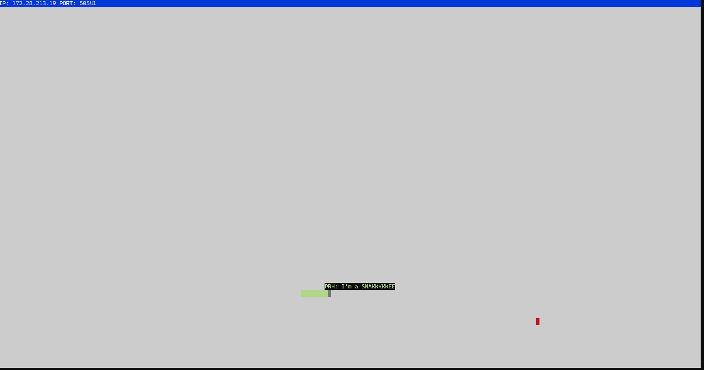

# Snake Client Project

Snake game is a very popular video game. It is a video game concept where the player maneuvers a dot and grows it by ‘eating’ pieces of food. As it moves and eats, it grows and the growing snake becomes an obstacle to smooth maneuvers. The goal is to grow it to become as big as possible without bumping into the side walls, or bumping into itself, upon which it dies.

This is simply a multiplayer take on the genre.

A terminal-based Snake implementation written in JavaScript (Node.js).

Before you can run this client, you will need to be running the server side which you can download and install from here. 

## Credits

This project was not built from scratch. It was inspired and started from [snek](https://github.com/taniarascia/snek) [(blog post)](https://www.taniarascia.com/snake-game-in-javascript/). [Tania Rascia](https://www.taniarascia.com/) is the original author.


## Final Product




## Getting Started

- Follow steps inside the snek server repo to run the server side
- Run the development snake client using the `node play.js` command.
- Traditional Game of Snake: viewed from a top down perspective
- Contol a "snake" with a fixed starting position
- The "head" of the snake moves forward based on your commands (see Commands) 
- Avoid hitting walls and yourself!


## Commands
- ```w```: Move snake up

- ```s```: Move snake down

- ```a```: Move snake left

- ```d```: Move snake right

- ```1```: Send message: SLOW DOWN

- ```2```: Send message: COME BACK

- ```3```: Send message: I'm a SNAKKKKKEE

- ```4```: Send message: HALLLLP

- ```CTRL```+```C```: Quit Game